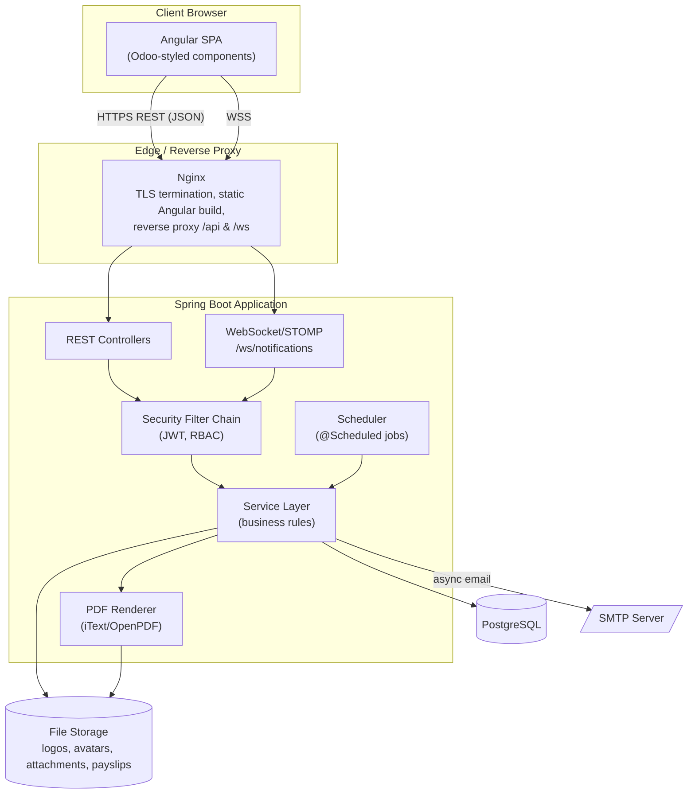
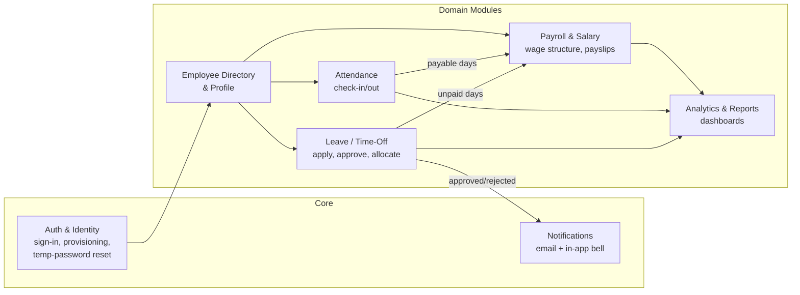
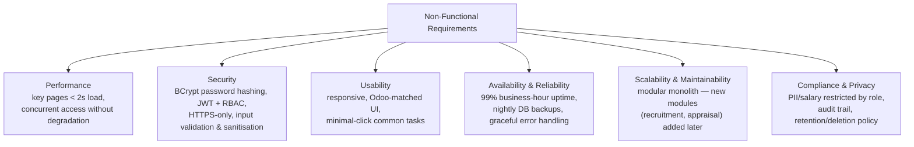

# DayFlow — HR & Payroll Management System

*"Every workday, perfectly aligned."*

This project is part of the **Odoo Hackathon** conducted at NMIT Bangalore. DayFlow is an HRMS (Human Resource Management System) built to help HR officers and admins manage employee onboarding, attendance, leave/time-off, and payroll — while giving employees self-service access to their own profile, attendance, and salary details.

- **Frontend:** Angular SPA, styled to match Odoo's design system
- **Backend:** Spring Boot (Java), Spring Data JPA/Hibernate, Spring Security (JWT)
- **Database:** PostgreSQL
- **Full requirements:** [`documentation/Dayflow_HRMS_SRS.md`](documentation/Dayflow_HRMS_SRS.md) (SRS v4.0)

## System Architecture

Dayflow is a decoupled 3-tier application: an Angular SPA talks to a stateless Spring Boot REST/WebSocket API, backed by PostgreSQL. Role-based middleware (JWT + RBAC) gates every request so Employees and Admin/HR see only what their role permits.



*Full C4 context/container/component + deployment diagrams: [`documentation/design/01-system-architecture.md`](documentation/design/01-system-architecture.md).*

## Functional Scope



| Module | Employee | Admin / HR Officer |
|---|---|---|
| Auth | Sign in, change own password | + provision new employee accounts |
| Directory & Profile | View all (read-only), edit **own** limited fields | View & **edit any** employee's full profile |
| Attendance | Check-in/out, view **own** history + counters | View **all** employees for a selected day |
| Leave | Apply, view own balances/calendar | Approve/reject, manage allocations |
| Payroll | View **own** Salary Info (read-only) | View/edit **any** employee's salary structure |
| Reports | — | Attendance/leave/payroll reports, dashboard |

*Detailed use cases: [`documentation/design/05-use-case-diagram.md`](documentation/design/05-use-case-diagram.md).*

## Non-Functional Requirements



*Full NFR-to-architecture mapping: [`documentation/design/01-system-architecture.md`](documentation/design/01-system-architecture.md#7-non-functional-requirement-mapping).*

## Documentation Guide

All requirements, design, and API artifacts live under [`documentation/`](documentation/):

```
documentation/
├── Dayflow_HRMS_SRS.md / .docx     ← Software Requirements Specification (v4.0, source of truth)
└── design/
    ├── 00-index.md                 ← Start here — navigation + scope notes
    ├── 01-system-architecture.md   ← Architecture style, C4 diagrams, deployment, tech stack
    ├── 02-hld.md                   ← High-Level Design: module map, layered view, role matrix
    ├── 03-lld.md                   ← Low-Level Design: packages, class diagrams, DB schema, algorithms
    ├── 04-er-diagram.md            ← Entity-Relationship diagram + cardinalities
    ├── 05-use-case-diagram.md      ← Actors, use cases, SRS traceability
    ├── 06-dfd.md                   ← Data Flow Diagrams (Level 0/1/2)
    ├── 07-process-flows.md         ← Flowcharts for onboarding, leave, payroll, attendance
    ├── 08-sequence-diagrams.md     ← Sequence diagrams for every key interaction
    ├── 09-api-documentation.md     ← REST endpoint reference + full OpenAPI 3.0 spec
    └── 10-class-diagram.md         ← Unified UML class diagram of the implemented domain model
```

**Where to look, depending on what you're doing:**

| If you're... | Start with |
|---|---|
| New to the project | [`design/00-index.md`](documentation/design/00-index.md) → [`01-system-architecture.md`](documentation/design/01-system-architecture.md) → [`02-hld.md`](documentation/design/02-hld.md) |
| Implementing the backend | [`03-lld.md`](documentation/design/03-lld.md) → [`04-er-diagram.md`](documentation/design/04-er-diagram.md) → [`09-api-documentation.md`](documentation/design/09-api-documentation.md) |
| Implementing the frontend | [`05-use-case-diagram.md`](documentation/design/05-use-case-diagram.md) → [`07-process-flows.md`](documentation/design/07-process-flows.md) → [`09-api-documentation.md`](documentation/design/09-api-documentation.md) |
| Working on payroll logic | [`03-lld.md` §2.5](documentation/design/03-lld.md#25-payroll--salary) → [`07-process-flows.md` §5–7](documentation/design/07-process-flows.md) → [`08-sequence-diagrams.md` §6–7](documentation/design/08-sequence-diagrams.md) |
| Checking a requirement against design | [`Dayflow_HRMS_SRS.md`](documentation/Dayflow_HRMS_SRS.md) §3 ↔ [`05-use-case-diagram.md` §4 traceability table](documentation/design/05-use-case-diagram.md#4-traceability-to-srs) |

The original wireframes (Excalidraw screenshots + the earlier v1 SRS draft PDF) that the design docs were derived from are kept locally under `Original Source/` — not committed to this repo (see `.gitignore`).

## Getting Started (backend)

```bash
cd hrmtool
./mvnw spring-boot:run
```

The Spring Boot application skeleton lives in `hrmtool/`; see [`documentation/design/03-lld.md`](documentation/design/03-lld.md#1-backend-package-structure) for the package layout as modules are implemented.

### Local email (MailDev)

Outgoing mail (account-provisioning emails with the Login ID/temp password,
leave-decision notifications, etc.) is sent via SMTP through
[MailDev](https://github.com/maildev/maildev) in local development — no real
mail provider is contacted. Run it with:

```bash
docker run -d --name mail-dev -p 1025:1025 -p 1080:1080 maildev/maildev
```

The backend's default `spring.mail.host`/`port` (`application.yaml`) point at
`localhost:1025`. Sent mail can be viewed in MailDev's web UI at
[http://localhost:1080](http://localhost:1080).
