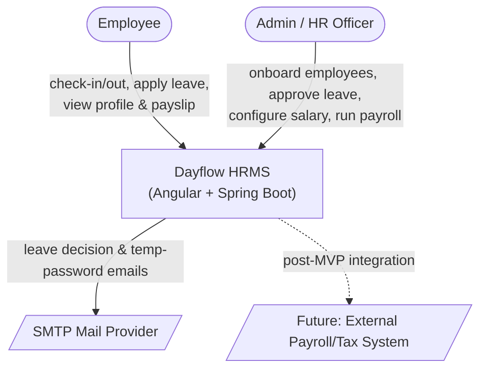
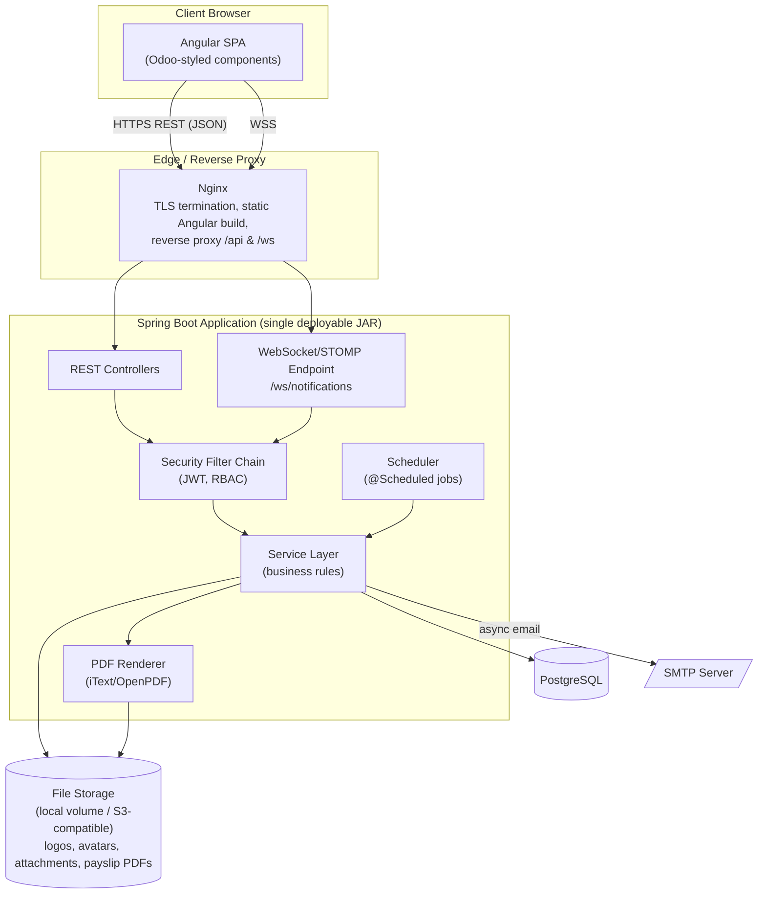
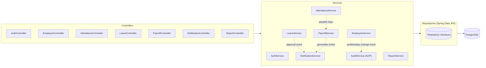
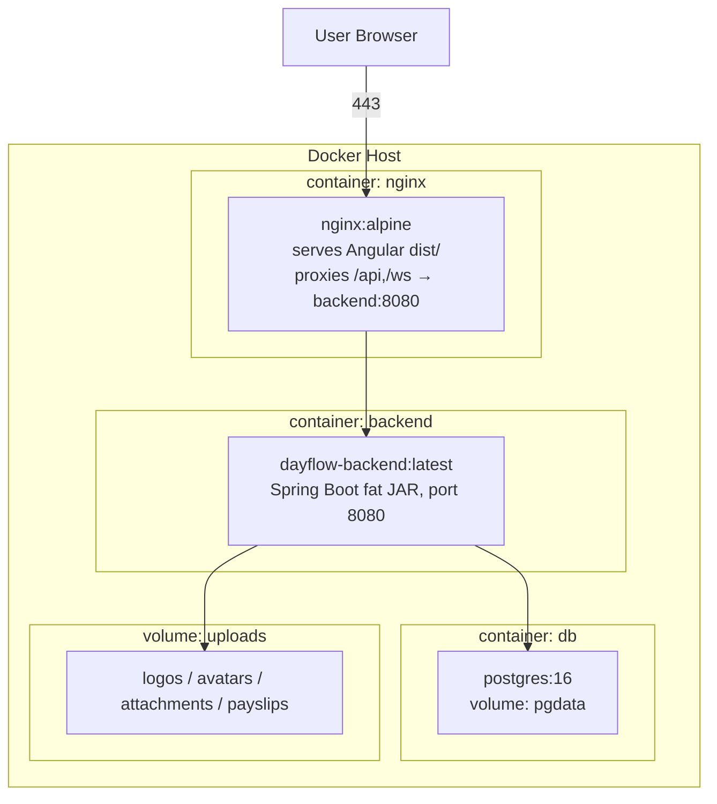

# Dayflow HRMS — System Architecture

> Source of truth: [`Dayflow_HRMS_SRS.md`](../Dayflow_HRMS_SRS.md) (v4.0) and the Excalidraw wireframes captured in `Original Source/imgs/`. This document translates SRS §5 (System Architecture & Technology Stack) into a concrete, buildable architecture.

## 1. Architectural Style

Dayflow is a **decoupled, stateless 3-tier web application**:

| Tier | Technology | Responsibility |
|---|---|---|
| Presentation | Angular SPA (Odoo-matched theme) | Renders UI, calls REST/WebSocket APIs, holds no business logic |
| Application / API | Spring Boot (Java), Spring Security, Spring Data JPA | Auth, RBAC, business rules, orchestration |
| Data | PostgreSQL | System of record |

Supporting services live **inside** the Spring Boot process (not separate microservices) — this is a modular monolith, which matches the hackathon timeline and SRS §4.5 (modular but not over-engineered).

- **Spring Mail** — outbound email (leave decisions, temp password delivery)
- **WebSocket/STOMP** — real-time in-app notification bell
- **iText/OpenPDF** — payslip and report PDF rendering
- **Docker / Docker Compose** — local dev + deployment packaging

## 2. Context Diagram (C4 Level 1)

## 3. Container Diagram (C4 Level 2)

## 4. Component Diagram (inside the Spring Boot app)

## 5. Deployment Diagram (Docker Compose)

Compose defines three services (`nginx`, `backend`, `db`) plus named volumes `pgdata` and `uploads`; environment-specific secrets (DB creds, JWT signing key, SMTP creds) are injected via `.env` / Docker secrets, never committed.

## 6. Cross-Cutting Concerns

| Concern | Approach |
|---|---|
| **AuthN** | JWT access token (short-lived, ~15 min) + refresh token (longer-lived, rotated), issued by `AuthService`, validated by a `JwtAuthFilter` in the Spring Security chain |
| **AuthZ** | Two roles — `ADMIN` (covers Admin & HR Officer per SRS §2) and `EMPLOYEE`. Enforced with `@PreAuthorize` at the service layer *and* mirrored in Angular route guards — SRS §4.2 requires RBAC on both UI and API |
| **Password storage** | BCrypt (strength ≥ 10), never plaintext, never logged |
| **Auditing** | `AuditLog` entity + JPA `@EntityListeners`/AOP `@Around` on Employee & SalaryStructure mutations — SRS §4.6 |
| **Notifications** | Domain events (`ApplicationEventPublisher`) → `NotificationService` persists a `Notification` row, pushes over STOMP topic `/topic/notifications/{userId}`, and triggers email via `Spring Mail` for leave decisions (SRS §3.7) |
| **Scheduling** | `@Scheduled` jobs: end-of-day missed check-out reminder, optional monthly payroll-run trigger |
| **File storage** | `StorageService` abstraction (local disk in dev, S3-compatible in prod) for company logos, avatars, leave attachments, generated PDFs |
| **PDF generation** | `PayslipPdfService` / `ReportPdfService` using iText/OpenPDF, invoked synchronously from `PayrollService` |
| **Validation** | Bean Validation (`jakarta.validation`) on DTOs at the controller boundary; business-rule validation (e.g., component sum ≤ wage) in the service layer |
| **Error handling** | Single `@RestControllerAdvice` mapping exceptions to a consistent `ApiError` JSON shape (see [API documentation](09-api-documentation.md)) |
| **Observability** | Spring Boot Actuator (`/actuator/health`, `/actuator/metrics`) behind admin-only network access |

## 7. Non-Functional Requirement Mapping

| SRS NFR | Architectural decision |
|---|---|
| §4.1 Performance — pages < 2s | Stateless API behind Nginx, paginated list endpoints, DB indexes on `employee_id`, `date`, `status` columns |
| §4.2 Security | JWT + RBAC + BCrypt + HTTPS-only + input validation (see table above) |
| §4.3 Usability | Angular Material/Odoo-styled component library, shared across all screens |
| §4.4 Availability | Stateless backend containers → horizontally scalable behind Nginx/load balancer; nightly `pg_dump` backup job |
| §4.5 Scalability/Maintainability | Modular monolith with clear package-per-module boundaries (see [LLD](03-lld.md) §1) so a module (e.g., Recruitment) can be extracted later |
| §4.6 Compliance | Field-level access control on salary/PII, `AuditLog` trail, retention policy hook on employee off-boarding |

## 8. Technology Stack (SRS §5.2, expanded)

| Layer | Technology | Notes |
|---|---|---|
| Frontend | Angular (latest LTS) | Component/theme styled to match Odoo's design system |
| Backend | Spring Boot 3.x (Java 21 LTS) | REST + WebSocket |
| ORM | Spring Data JPA / Hibernate | Entity-per-aggregate, see [ER Diagram](04-er-diagram.md) |
| Database | PostgreSQL 16 | ACID compliance for payroll correctness |
| Security | Spring Security 6 + JJWT | JWT-based auth, RBAC |
| Mail | Spring Mail (JavaMailSender) | SMTP; templated via Thymeleaf email templates |
| Real-time | Spring WebSocket + STOMP over SockJS fallback | Notification bell |
| Reporting/PDF | iText / OpenPDF | Payslips, attendance/leave reports |
| API docs | springdoc-openapi (Swagger UI) | See [API documentation](09-api-documentation.md) |
| Containerisation | Docker + Docker Compose | `nginx`, `backend`, `db` services |
| CI (recommended) | GitHub Actions | Build, test, Docker image publish |

---
**Related documents:** [High-Level Design](02-hld.md) · [Low-Level Design](03-lld.md) · [ER Diagram](04-er-diagram.md)
