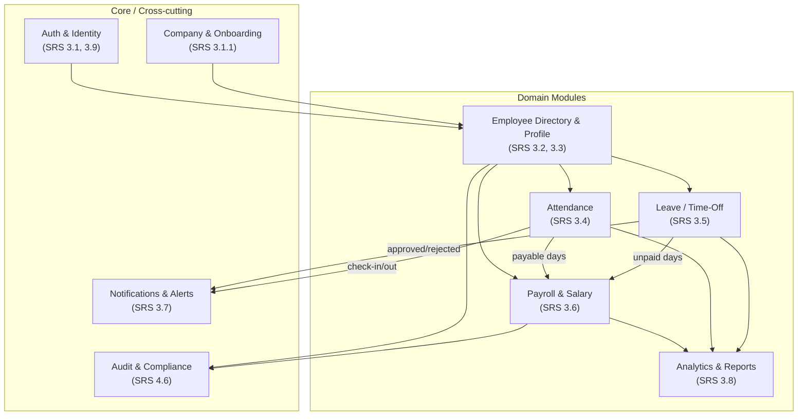
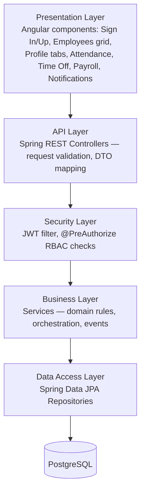

# Dayflow HRMS — High-Level Design (HLD)

> Companion to [System Architecture](01-system-architecture.md). This document breaks the system into functional modules, states each module's responsibility, key entities, and its interactions with other modules, per SRS §3.

## 1. Module Map

## 2. Layered View

## 3. Module Specifications

### 3.1 Auth & Identity
- **Responsibility:** Login-ID generation, credential issuance, sign-in, JWT issuance/refresh, forced temp-password change.
- **Key entities:** `User`, `Employee` (1:1)
- **Key rules:**
  - No public self-registration — only Admin/HR can provision accounts (SRS §3.1.1).
  - Login ID format: `[Company Initials][First2(FirstName)+First2(LastName)][YearOfJoining][4-digit serial]`, e.g. `OIJODO20220001`.
  - Temp password auto-generated, must be changed on/after first login (Security tab, SRS §3.9).
- **Exposes to other modules:** authenticated `Principal` (userId, employeeId, role) used by every downstream module for RBAC and "my profile" style endpoints.

### 3.2 Company & Onboarding
- **Responsibility:** Company profile (name, logo) captured at first Admin sign-up; new-employee creation form.
- **Key entities:** `Company`
- **Interactions:** Feeds `Company.initials` into the Login-ID algorithm in Auth; feeds `Company.workingDaysPerWeek` / holiday calendar into Attendance and Leave.

### 3.3 Employee Directory & Profile
- **Responsibility:** The Employees landing page (searchable card grid with status dots), profile view (read-only from directory) vs. edit (My Profile), tabbed profile (Resume, Private Info, Salary Info, Security).
- **Key entities:** `Employee`, `Resume`, `Skill`, `Certification`, `BankDetail`
- **Key rules:**
  - Card status dot: green = present, airplane = on leave, yellow = absent/unaccounted — computed from today's `Attendance` + `LeaveRequest` state, not stored redundantly.
  - View-only when opened from directory; only the owner's "My Profile" (or Admin override) is editable.
  - Employees edit a limited field set; Admin edits everything including Salary Info.
- **Interactions:** Supplies employee context to Attendance, Leave, Payroll; consumes today's status from Attendance/Leave to render directory dots.

### 3.4 Attendance
- **Responsibility:** Check-in/out systray, daily attendance record, day-wise self view with counters, Admin all-employee day view.
- **Key entities:** `Attendance`
- **Key rules:**
  - One `Attendance` row per employee per date; check-in sets `checkInTime` and status `PRESENT`; check-out sets `checkOutTime`, computes `workHours`/`extraHours`.
  - Feeds **Payable Days** calculation consumed by Payroll (SRS §3.4.3): unpaid leave or missing attendance reduces payable days.
- **Interactions → Payroll:** monthly payable-days aggregate. **→ Notifications:** missed check-out reminder.

### 3.5 Leave / Time-Off
- **Responsibility:** Leave types & balances, apply-for-leave form + attachment, year calendar (Validated/To Approve/Refused + public holidays), Admin approval table, leave-allocation management.
- **Key entities:** `LeaveType`, `LeaveAllocation`, `LeaveRequest`, `PublicHoliday`
- **Key rules:**
  - Leave types: Paid Time Off, Sick Leave, Unpaid Leave (extensible).
  - Status lifecycle: `PENDING → APPROVED | REJECTED`, decided only by Admin/HR, with optional comment.
  - Approval instantly updates the requester's calendar and the Attendance-derived payable-days input for Payroll.
- **Interactions → Notifications:** approval/rejection emails + bell alert; **→ new-request alert** to Admin/HR. **→ Payroll:** unpaid-leave days.

### 3.6 Payroll & Salary
- **Responsibility:** Wage & salary-structure configuration (Admin-only), auto-computation of components, PF and professional-tax configuration, employee read-only view, payslip generation.
- **Key entities:** `SalaryStructure`, `SalaryComponent`, `Payslip`
- **Key rules (SRS §3.6.2):**
  - Wage Type = Fixed, entered Monthly, Yearly derived (`yearly = monthly × 12`).
  - Components: Basic, HRA, Standard Allowance, Performance Bonus, LTA, Fixed Allowance — each `FIXED` or `% of Wage` (HRA is modeled as % of Basic per the wireframe); values recompute whenever Wage changes.
  - `Σ(components) ≤ Wage`; **Fixed Allowance always absorbs the remainder** — it is a derived field, never independently editable.
  - PF: separate Employee % and Employer % applied to **Basic Salary**.
  - Professional Tax: flat monthly amount deducted from gross.
  - Payslip generation multiplies the daily-equivalent salary by **payable days** from Attendance/Leave for that month.
- **Interactions:** consumes Attendance + Leave payable-days; produces `Payslip` PDFs consumed by Reports and the employee's Salary Info tab.

### 3.7 Notifications & Alerts
- **Responsibility:** In-app bell (unread count), email alerts (leave decisions), missed check-in/out reminders, per-user notification preferences.
- **Key entities:** `Notification`, `NotificationPreference`
- **Interactions:** Subscriber to domain events raised by Leave, Attendance, Payroll modules; publishes to WebSocket topic and/or SMTP.

### 3.8 Analytics & Reports
- **Responsibility:** Attendance summary (daily/weekly/monthly), leave balance/utilization, payroll reports, downloadable salary slips, Admin dashboard (attendance %, leave trends, headcount by department).
- **Key entities:** read-only aggregations over `Attendance`, `LeaveRequest`, `Payslip`, `Employee` — no dedicated write model.
- **Interactions:** Pure consumer of Attendance, Leave, Payroll, Profile data; produces PDF/CSV exports via the shared PDF renderer.

### 3.9 Audit & Compliance
- **Responsibility:** Track who changed what on Employee/Salary/Leave records and when; support data-retention rules for exited employees.
- **Key entities:** `AuditLog`
- **Interactions:** Cross-cutting listener on Profile and Payroll mutations; not user-facing in MVP beyond an Admin audit view.

## 4. Role → Module Capability Matrix

| Module | Employee | Admin / HR Officer |
|---|---|---|
| Auth | Sign in, change own password | + create employee accounts (provisioning) |
| Directory & Profile | View all (read-only), edit **own** limited fields | View & **edit any** employee, full profile |
| Attendance | Check-in/out, view **own** history + counters | View **all** employees for a selected day, search |
| Leave | Apply, view own balances/calendar | View all requests, approve/reject, manage allocations |
| Payroll | View **own** Salary Info (read-only) | View/edit **any** employee's salary structure |
| Notifications | Own notifications & preferences | Own + new-leave-request alerts |
| Reports | — | Attendance/leave/payroll reports, dashboard |

## 5. High-Level Data Flow Summary

Check-in/out and Leave decisions are the two events that ripple furthest through the system — both ultimately affect **Payable Days**, which is the single number Payroll depends on. See [DFD](06-dfd.md) for the formal data-flow model and [Process Flows](07-process-flows.md) for the step-by-step logic.

---
**Related documents:** [System Architecture](01-system-architecture.md) · [Low-Level Design](03-lld.md) · [Use Case Diagram](05-use-case-diagram.md)
