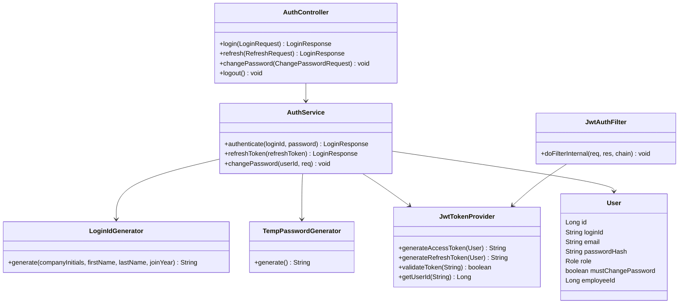
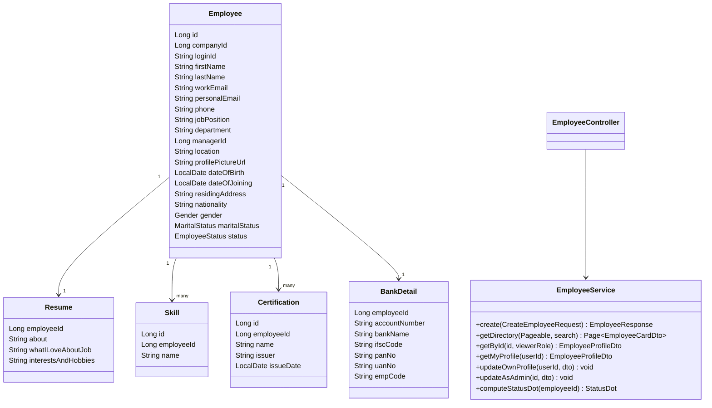
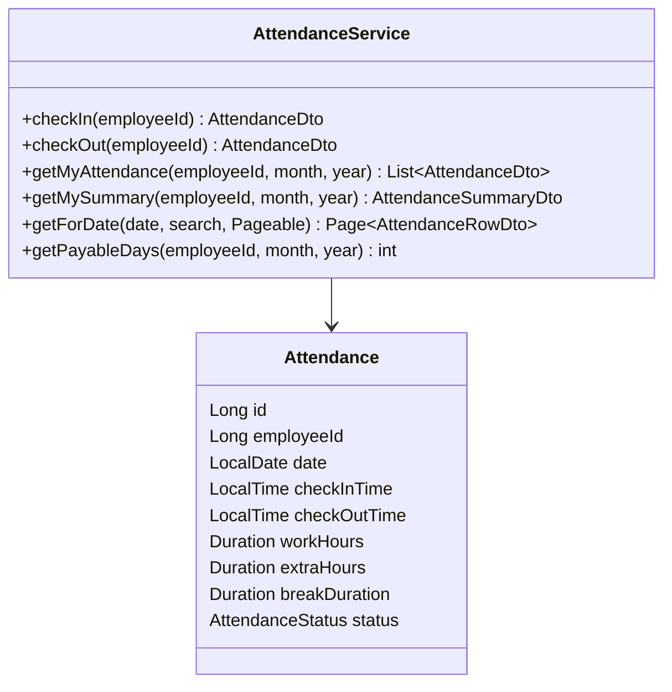
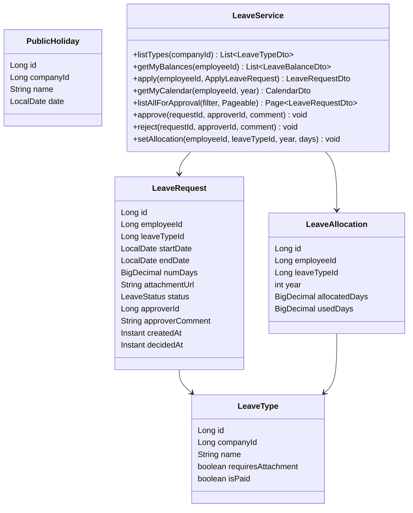
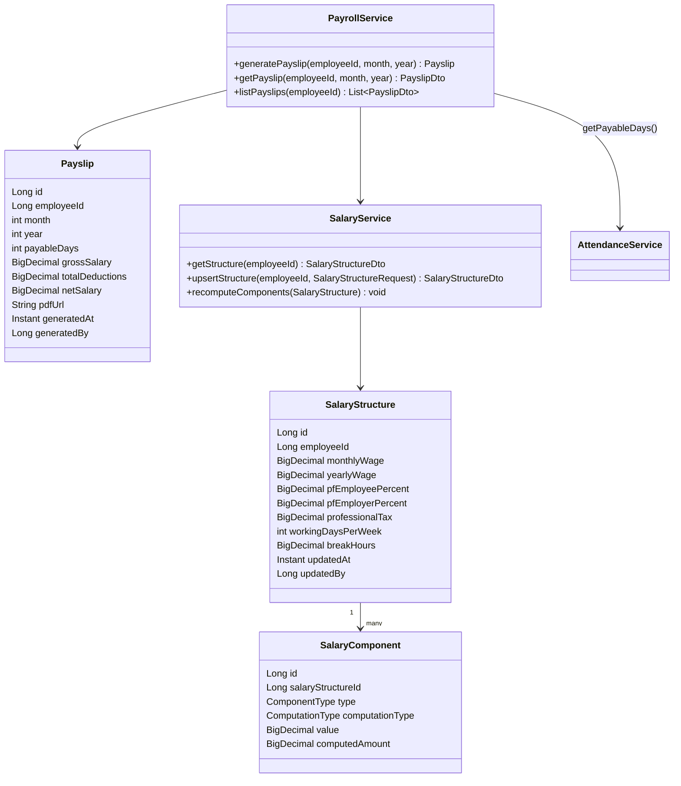
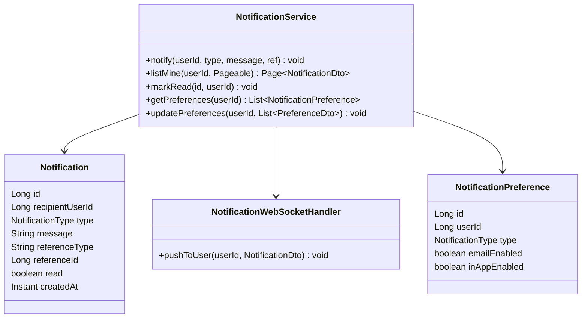
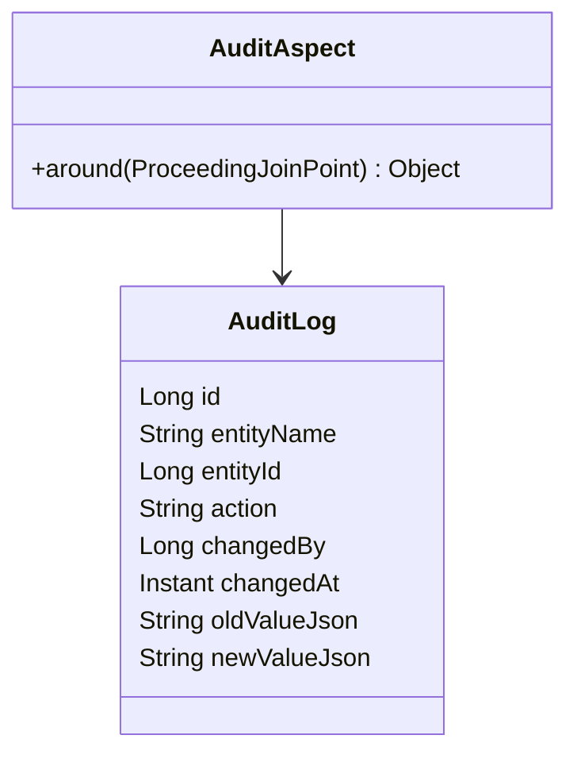

# Dayflow HRMS — Low-Level Design (LLD)

> Implementation-level detail under the [HLD](02-hld.md) modules and [Architecture](01-system-architecture.md), scoped to the `hrmtool` Spring Boot codebase (`com.dayflow.hrmtool`) and its Angular counterpart.

## 1. Backend Package Structure

```
com.dayflow.hrmtool
├── config/            SecurityConfig, JwtConfig, WebSocketConfig, OpenApiConfig, CorsConfig, AsyncConfig
├── security/          JwtTokenProvider, JwtAuthFilter, UserDetailsServiceImpl, CustomAuthEntryPoint, RoleConstants
├── common/            ApiResponse<T>, ApiError, PageResponse<T>, GlobalExceptionHandler, BaseEntity (id, createdAt, updatedAt)
├── company/           Company, CompanyRepository, CompanyService, CompanyController, dto/
├── auth/              AuthController, AuthService, LoginIdGenerator, TempPasswordGenerator, dto/ (LoginRequest, LoginResponse, ChangePasswordRequest)
├── employee/          Employee, Resume, Skill, Certification, BankDetail, *Repository, EmployeeService, EmployeeController, mapper/, dto/
├── attendance/        Attendance, AttendanceRepository, AttendanceService, AttendanceController, dto/
├── leave/             LeaveType, LeaveAllocation, LeaveRequest, PublicHoliday, *Repository, LeaveService, LeaveController, dto/
├── payroll/           SalaryStructure, SalaryComponent, Payslip, *Repository, SalaryService, PayrollService, PayslipPdfService, PayrollController, dto/
├── notification/      Notification, NotificationPreference, *Repository, NotificationService, NotificationController, NotificationWebSocketHandler
├── report/            ReportService, ReportController, dto/ (aggregation DTOs)
├── audit/             AuditLog, AuditLogRepository, AuditAspect (AOP)
└── HrmtoolApplication.java
```

**Conventions:** each module is a vertical slice (entity → repository → service → controller → DTO/mapper); cross-module calls go through the target module's service interface only, never its repository — this is what keeps the monolith modular per SRS §4.5.

## 2. Class Diagrams by Module

### 2.1 Auth & Security



**`LoginIdGenerator.generate` algorithm** (SRS §3.1.1):
```
initials      = company.initials                         // e.g. "OI"
namePart      = upper(first2(firstName) + first2(lastName)) // e.g. "JODO"
yearPart      = yearOfJoining                             // e.g. 2022
serial        = nextSerialForYear(company, yearOfJoining) // zero-padded, 4 digits, per-company per-year counter
return initials + namePart + yearPart + pad4(serial)      // "OIJODO20220001"
```
`nextSerialForYear` is a per-`(company_id, year)` atomic counter (DB sequence or `SELECT ... FOR UPDATE` on a counter row) to guarantee uniqueness under concurrent onboarding.

### 2.2 Employee & Profile



`computeStatusDot(employeeId)` is **not persisted** — it is derived at read-time from today's `Attendance` row (present ⇒ green) and today's `LeaveRequest` (approved & in range ⇒ airplane), defaulting to yellow (SRS §3.2.1).

### 2.3 Attendance



**Payable-days algorithm** (SRS §3.4.3, consumed by Payroll):
```
totalWorkingDays = workingDaysInMonth(company.workingDaysPerWeek, month, year) - publicHolidaysInMonth
presentDays      = count(Attendance where status = PRESENT or HALF_DAY(0.5) for month)
approvedPaidLeaveDays = count(LeaveRequest where status = APPROVED and type != UNPAID_LEAVE, clipped to month)
payableDays      = presentDays + approvedPaidLeaveDays          // capped at totalWorkingDays
unpaidDeductionDays = count(LeaveRequest where type = UNPAID_LEAVE, APPROVED) + missingAttendanceDays
// missingAttendanceDays = totalWorkingDays - presentDays - approvedPaidLeaveDays - approvedUnpaidDays, floored at 0
```

### 2.4 Leave / Time-Off



**Apply-for-leave validation rules:**
1. `endDate >= startDate`; `numDays` computed as inclusive business days unless overridden.
2. If `leaveType.requiresAttachment` (e.g., Sick Leave) and duration exceeds the company's configured threshold, `attachmentUrl` is required.
3. `numDays` must not exceed `allocation.allocatedDays - allocation.usedDays` for paid types (Unpaid Leave has no balance ceiling).
4. On `approve`: `LeaveAllocation.usedDays += numDays` (paid types only); publish `LeaveDecidedEvent` → Notifications; recompute affected month's payable days lazily (on next payroll read, not eagerly).
5. On `reject`: no balance change; publish `LeaveDecidedEvent`.

### 2.5 Payroll & Salary



**Component computation algorithm** (SRS §3.6.2 — matches the wireframe example exactly):
```
input: monthlyWage, list of component configs {type, computationType, value}

yearlyWage = monthlyWage * 12

basic = computationType(BASIC) == FIXED ? value : monthlyWage * value%
runningTotal = basic

for each component in [HRA, STANDARD_ALLOWANCE, PERFORMANCE_BONUS, LTA]:
    amount = computationType == FIXED
                ? value
                : basic * value%          // HRA/Perf.Bonus/LTA are % of BASIC per wireframe
    runningTotal += amount

fixedAllowance = monthlyWage - runningTotal     // absorbs remainder — never independently set
assert fixedAllowance >= 0                      // reject config if components alone exceed wage
runningTotal += fixedAllowance
assert runningTotal == monthlyWage              // Σ(components) == Wage, invariant

pfEmployee = basic * pfEmployeePercent%
pfEmployer = basic * pfEmployerPercent%         // employer share tracked, not deducted from employee net
```
Example from the wireframe: Wage = ₹50,000 → Basic 50% = ₹25,000, HRA 50%-of-Basic = ₹12,500, Standard Allowance ₹4,167 (16.67%), Performance Bonus ₹2,082.50 (8.33%), LTA ₹2,082.50 (8.33%), Fixed Allowance = remainder ₹4,168; PF Employee/Employer = 12% of Basic = ₹3,000 each; Professional Tax = flat ₹200/month.

**Payslip generation algorithm** (SRS §3.4.3 + §3.6):
```
structure   = SalaryService.getStructure(employeeId)
payableDays = AttendanceService.getPayableDays(employeeId, month, year)
totalWorkingDays = workingDaysInMonth(...)

grossSalary = structure.monthlyWage * (payableDays / totalWorkingDays)
deductions  = structure.pfEmployeeAmount + structure.professionalTax
netSalary   = grossSalary - deductions

payslip = save(Payslip{employeeId, month, year, payableDays, grossSalary, deductions, netSalary})
pdfUrl  = PayslipPdfService.render(payslip, structure, employee)
```

### 2.6 Notifications



Event listeners: `@EventListener(LeaveAppliedEvent)` → notify all Admin/HR; `@EventListener(LeaveDecidedEvent)` → notify requester (email + in-app); `@Scheduled` end-of-day job → notify employees with a check-in but no check-out.

### 2.7 Audit


Implemented as a Spring AOP `@Around` advice on `@Auditable`-annotated service methods in `EmployeeService` (profile/salary edits) — captures before/after JSON snapshots without polluting business logic.

## 3. Database Schema (DDL-level detail)

All tables include `id BIGSERIAL PRIMARY KEY`, `created_at TIMESTAMPTZ DEFAULT now()`, `updated_at TIMESTAMPTZ` unless noted.

| Table | Key columns | Constraints / Indexes |
|---|---|---|
| `company` | name, logo_url, initials, working_days_per_week, break_hours | `UNIQUE(initials)` |
| `app_user` | login_id, email, password_hash, role, must_change_password, employee_id (FK) | `UNIQUE(login_id)`, `UNIQUE(email)` |
| `employee` | company_id (FK), first_name, last_name, work_email, personal_email, phone, job_position, department, manager_id (FK→employee.id), location, profile_picture_url, dob, doj, residing_address, nationality, gender, marital_status, status, year_of_joining, serial_no | `INDEX(company_id, status)` |
| `resume` | employee_id (FK, unique), about, love_about_job, interests | 1:1 with employee |
| `skill` | employee_id (FK), name | `INDEX(employee_id)` |
| `certification` | employee_id (FK), name, issuer, issue_date | `INDEX(employee_id)` |
| `bank_detail` | employee_id (FK, unique), account_number, bank_name, ifsc_code, pan_no, uan_no, emp_code | encrypted at rest (application-level) |
| `attendance` | employee_id (FK), date, check_in_time, check_out_time, work_hours, extra_hours, break_duration, status | `UNIQUE(employee_id, date)`, `INDEX(date)` |
| `leave_type` | company_id (FK), name, requires_attachment, is_paid | `UNIQUE(company_id, name)` |
| `leave_allocation` | employee_id (FK), leave_type_id (FK), year, allocated_days, used_days | `UNIQUE(employee_id, leave_type_id, year)` |
| `leave_request` | employee_id (FK), leave_type_id (FK), start_date, end_date, num_days, attachment_url, status, approver_id (FK), approver_comment, decided_at | `INDEX(employee_id, status)`, `INDEX(status)` |
| `public_holiday` | company_id (FK), name, date | `INDEX(company_id, date)` |
| `salary_structure` | employee_id (FK, unique), monthly_wage, yearly_wage, pf_employee_pct, pf_employer_pct, professional_tax, working_days_per_week, break_hours, updated_by | 1:1 with employee |
| `salary_component` | salary_structure_id (FK), type, computation_type, value, computed_amount | `UNIQUE(salary_structure_id, type)` |
| `payslip` | employee_id (FK), month, year, payable_days, gross_salary, total_deductions, net_salary, pdf_url, generated_by | `UNIQUE(employee_id, month, year)` |
| `notification` | recipient_user_id (FK), type, message, reference_type, reference_id, read, created_at | `INDEX(recipient_user_id, read)` |
| `notification_preference` | user_id (FK), type, email_enabled, in_app_enabled | `UNIQUE(user_id, type)` |
| `audit_log` | entity_name, entity_id, action, changed_by, changed_at, old_value_json, new_value_json | `INDEX(entity_name, entity_id)` |

Full relationships and cardinalities are formalized in the [ER Diagram](04-er-diagram.md).

## 4. Frontend (Angular) Structure

```
src/app/
├── core/            auth.guard.ts, role.guard.ts, jwt.interceptor.ts, api.service.ts, websocket.service.ts
├── shared/          odoo-theme components (status-dot, top-nav, avatar-menu, systray-checkin)
├── auth/            sign-in, sign-up (admin-provisioning form)
├── employees/       employee-grid (card view), employee-profile (view + edit tabs: resume, private-info, salary-info, security)
├── attendance/      my-attendance, all-attendance (admin)
├── time-off/        my-time-off (balances + calendar + request modal), approvals (admin table), allocations (admin)
├── payroll/         salary-structure-editor (admin), payslip-view
├── notifications/   notification-bell, preferences
└── reports/         dashboard, exportable report views
```
`role.guard.ts` mirrors backend `@PreAuthorize` checks so an Employee never even renders Admin-only routes (Salary edit, Approvals, Allocations) — defense in depth per SRS §4.2.

---
**Related documents:** [System Architecture](01-system-architecture.md) · [ER Diagram](04-er-diagram.md) · [API Documentation](09-api-documentation.md) · [Sequence Diagrams](08-sequence-diagrams.md)
