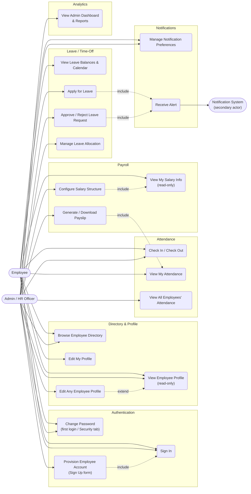

# Dayflow HRMS — Use Case Diagram

> Actors and use cases derived from SRS §2 (User Classes) and §3 (Functional Requirements). Mermaid has no native UML use-case shape, so actors are drawn as stadium nodes and use cases as rounded rectangles grouped by module, matching standard use-case notation as closely as the tool allows.

## 1. Use Case Diagram

## 2. Actor Definitions

| Actor | Type | Description |
|---|---|---|
| **Employee** | Primary | Regular user; limited to own data plus read-only visibility of colleagues' directory cards (SRS §2) |
| **Admin / HR Officer** | Primary | Superset of Employee capabilities plus management/approval privileges — modeled as a single `ADMIN` role (SRS treats these as one privilege tier) |
| **Notification System** | Secondary | Internal subsystem (email + WebSocket) triggered by other use cases, not a human actor |

## 3. Use Case Specifications (primary flows)

### UC1 — Sign In
- **Actor:** Employee, Admin/HR
- **Preconditions:** Account was provisioned by an Admin/HR (UC3); user has Login ID/Email + password.
- **Main flow:** User submits credentials → system validates → on success, issues JWT and redirects to Employee Directory (SRS §3.1.2, 3.2). On first login with a temp password, system forces UC2 before allowing further navigation.
- **Alternate flow:** Invalid credentials → clear error message, no token issued.

### UC3 — Provision Employee Account
- **Actor:** Admin/HR
- **Main flow:** Admin fills Company Name (+logo), Name, Email, Phone, sets Password/Confirm Password → system auto-generates Login ID (`OIJODO20220001` format) and a temporary password → account created with `must_change_password = true` (SRS §3.1.1).
- **Postconditions:** New `Employee` + `App_User` rows exist; employee can perform UC1 with the temp password.

### UC5 / UC7 — View / Edit Employee Profile
- **Actor:** Employee (view others, edit own), Admin/HR (view & edit any)
- **Main flow:** Opening a card from the directory always opens **view-only** (UC5); an explicit "Edit" action is required to reach edit mode, and that action is only exposed to the profile owner or an Admin (UC7) (SRS §3.3.2, wireframe annotation "make cards open in view-only mode").
- **Business rule:** The Salary Info tab is visible read-only to the employee on their own profile, but only Admin can edit it — flagged in the SRS as a confirmed-open item now resolved this way (SRS §3.3.2 note).

### UC8 — Check In / Check Out
- **Actor:** Employee (including Admin/HR acting as employees)
- **Main flow:** User triggers Check In from the systray → status dot turns green, elapsed-time counter starts → user triggers Check Out later → `Attendance` row for today is finalized with work/extra hours (SRS §3.2.2, §3.4.1).

### UC12 — Apply for Leave
- **Actor:** Employee
- **Preconditions:** Sufficient balance in `LeaveAllocation` for paid types.
- **Main flow:** Employee opens "Time Off Type Request" modal, selects Type, Validity Period, Allocation (days), optionally attaches a document → submits → request created with status `PENDING` → UC20 notifies Admin/HR (SRS §3.5.2).

### UC13 — Approve / Reject Leave Request
- **Actor:** Admin/HR
- **Main flow:** Admin opens the requests table, reviews Name/Dates/Type, optionally adds a comment, clicks Approve or Reject → status updates, employee's calendar and balance update immediately, UC20 notifies the requester by email + in-app bell (SRS §3.5.3, §3.7).

### UC16 — Configure Salary Structure
- **Actor:** Admin/HR
- **Main flow:** Admin sets Monthly Wage and each component's computation type (Fixed/%) → system recalculates all component amounts live, with Fixed Allowance absorbing the remainder, and validates `Σ(components) ≤ Wage` (SRS §3.6.2).

### UC17 — Generate / Download Payslip
- **Actor:** Admin/HR (generate for any employee), Employee (download own, once generated)
- **Main flow:** System reads the employee's `SalaryStructure` and that month's payable days (from UC8/UC9 data via Attendance→Payroll link, SRS §3.4.3) → computes gross/net → renders a PDF → stores and exposes for download (SRS §3.8).

### UC18 — View Admin Dashboard & Reports
- **Actor:** Admin/HR
- **Main flow:** Dashboard aggregates attendance %, leave trends, and headcount by department; exportable attendance/leave/payroll reports (SRS §3.8).

## 4. Traceability to SRS

| Use Case | SRS Section |
|---|---|
| UC1–UC3 | §3.1 |
| UC4–UC7 | §3.2, §3.3 |
| UC8–UC10 | §3.4 |
| UC11–UC14 | §3.5 |
| UC15–UC17 | §3.6 |
| UC18 | §3.8 |
| UC19–UC20 | §3.7 |
| UC2 (change password) | §3.9 |

---
**Related documents:** [High-Level Design](02-hld.md) · [Process Flows](07-process-flows.md) · [Sequence Diagrams](08-sequence-diagrams.md)
