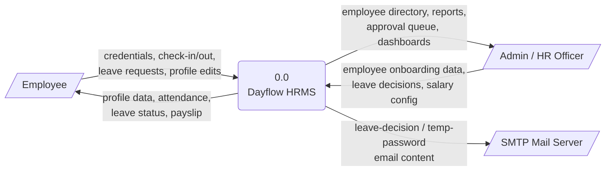
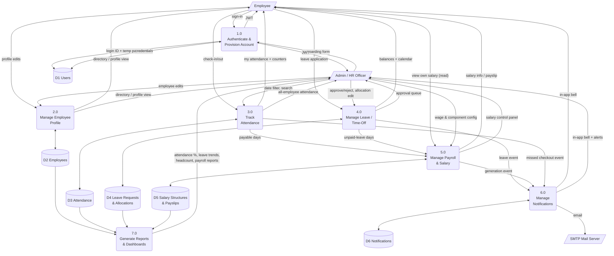
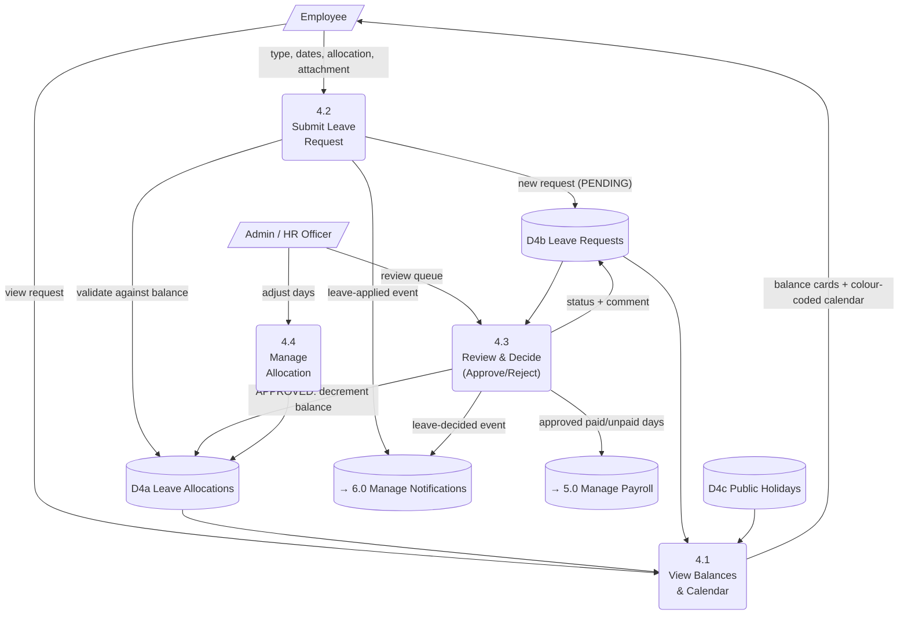
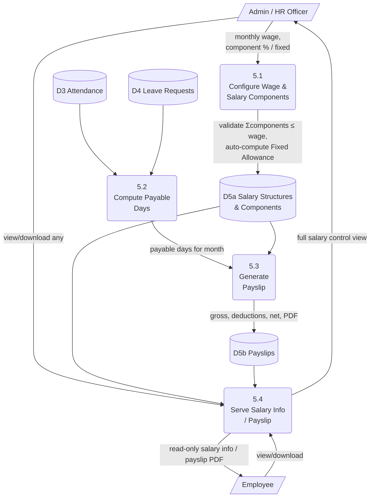

# Dayflow HRMS — Data Flow Diagrams (DFD)

> Gane-Sarson style notation, drawn with Mermaid flowcharts: rectangles = external entities, rounded rectangles = processes, open-ended bars = data stores.

## 1. Level 0 — Context Diagram

## 2. Level 1 — Major Processes

## 3. Level 2 — Process 4.0 Manage Leave / Time-Off (decomposed)

## 4. Level 2 — Process 5.0 Manage Payroll & Salary (decomposed)

## 5. Data Store Reference

| Store | Backing table(s) (see [ER Diagram](04-er-diagram.md)) |
|---|---|
| D1 Users | `app_user` |
| D2 Employees | `employee`, `resume`, `skill`, `certification`, `bank_detail` |
| D3 Attendance | `attendance` |
| D4 Leave Requests & Allocations | `leave_request`, `leave_allocation`, `leave_type`, `public_holiday` |
| D5 Salary Structures & Payslips | `salary_structure`, `salary_component`, `payslip` |
| D6 Notifications | `notification`, `notification_preference` |

---
**Related documents:** [Process Flows](07-process-flows.md) · [ER Diagram](04-er-diagram.md) · [HLD](02-hld.md)
