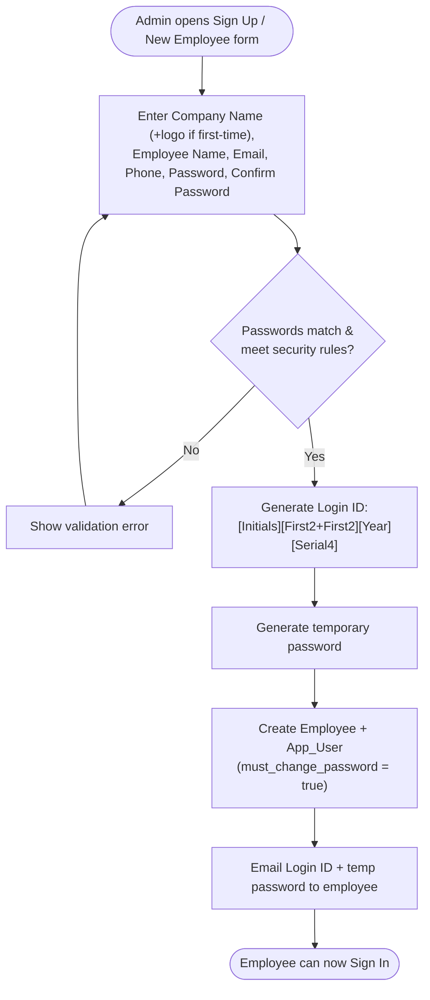
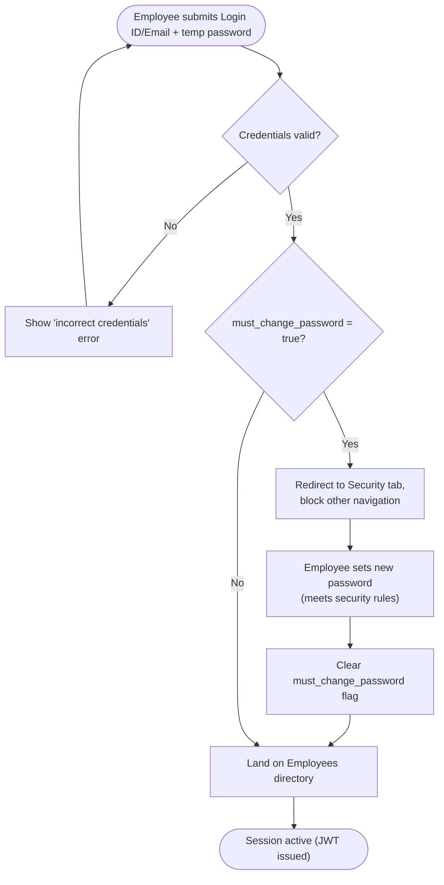
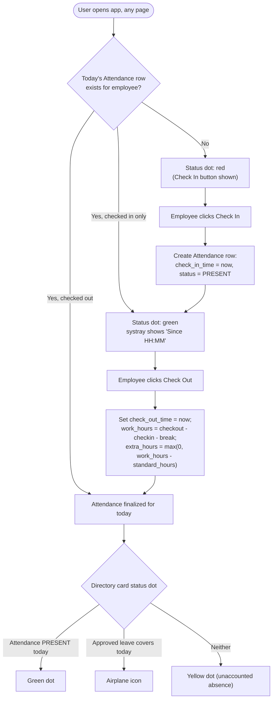
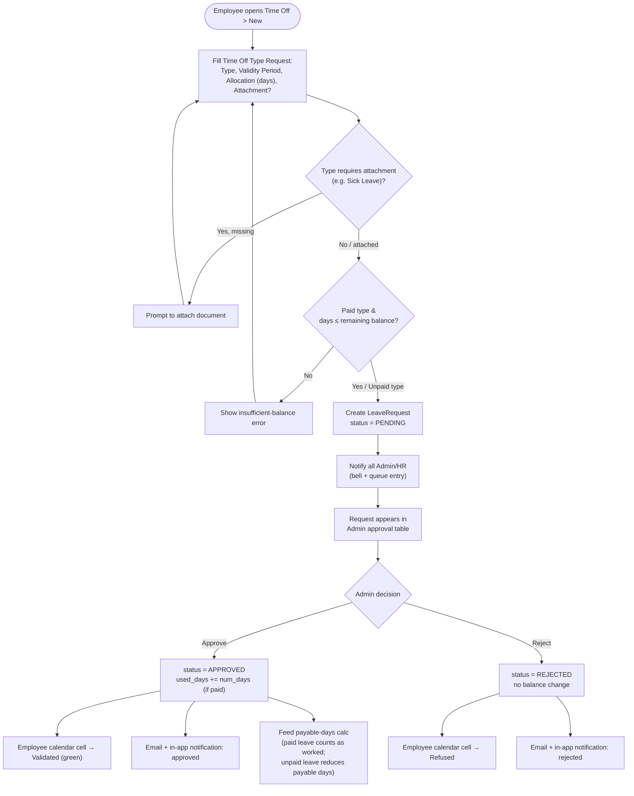
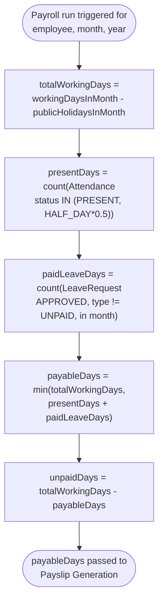
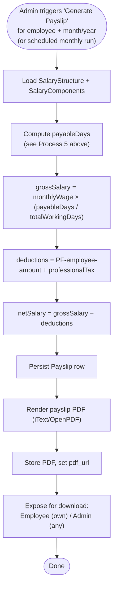
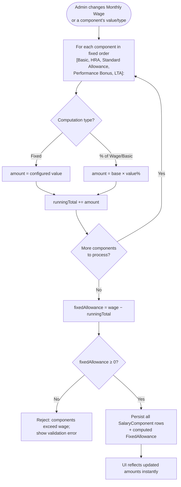

# Dayflow HRMS — Process Flows

> Step-by-step business logic flowcharts for the processes identified in the [DFD](06-dfd.md) and [HLD](02-hld.md).

## 1. Employee Onboarding (Admin-Provisioned Account)

## 2. First Login & Forced Password Change

## 3. Daily Check-In / Check-Out & Status Dot

## 4. Leave Application & Approval

## 5. Payable-Days Computation (Attendance → Payroll link)

## 6. Payslip Generation

## 7. Salary Component Auto-Recalculation (live UI behaviour)

---
**Related documents:** [Sequence Diagrams](08-sequence-diagrams.md) · [DFD](06-dfd.md) · [Use Case Diagram](05-use-case-diagram.md)
