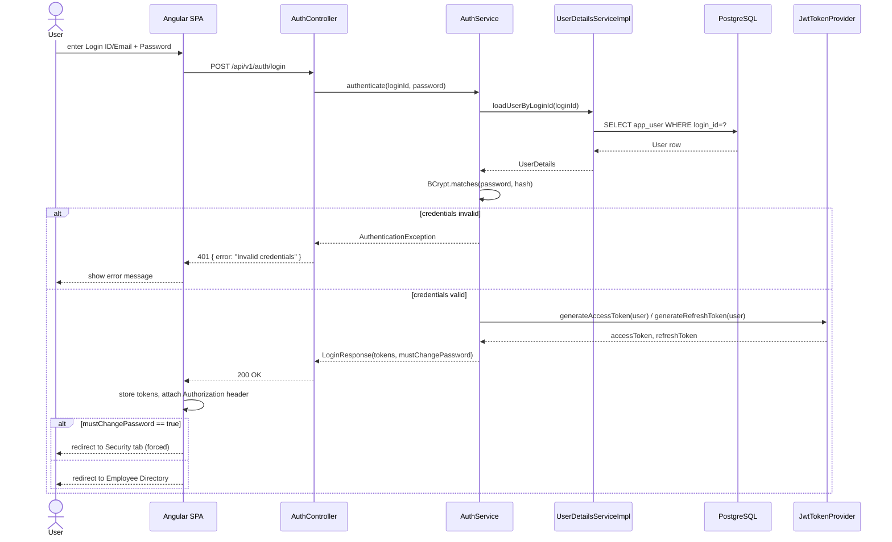
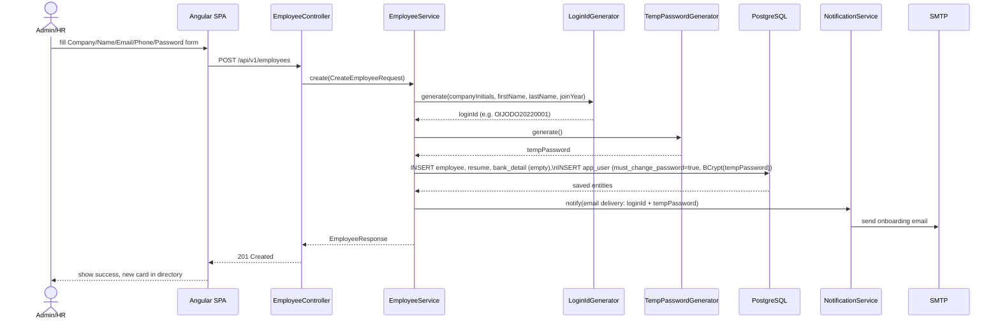
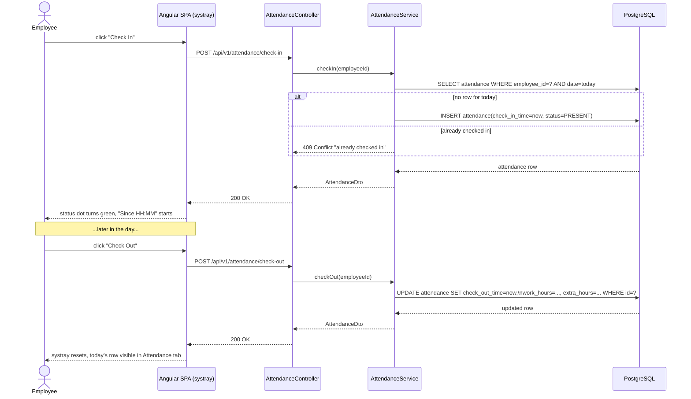
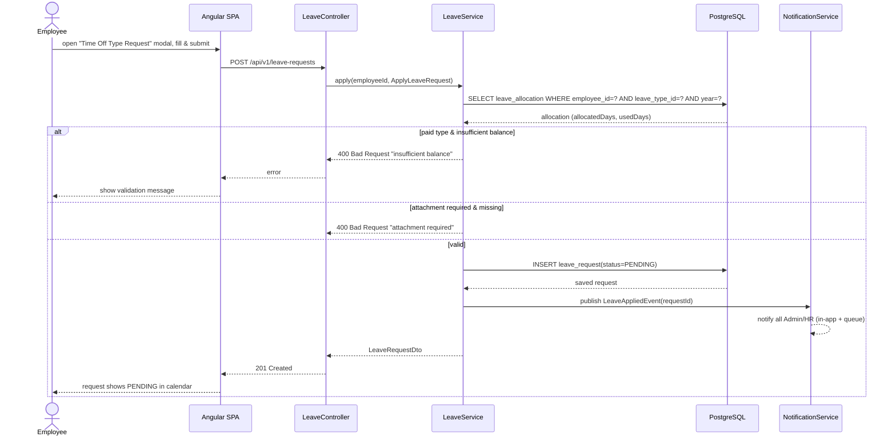
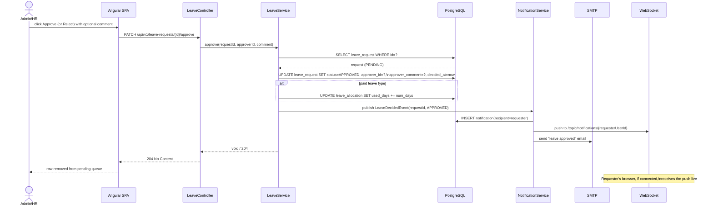
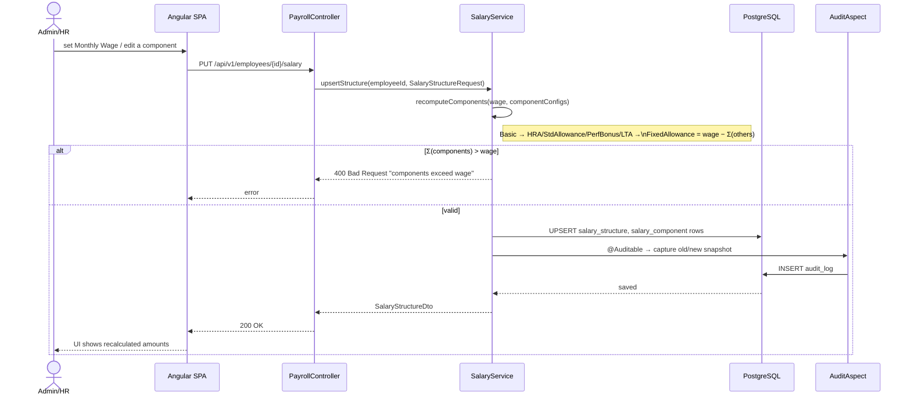
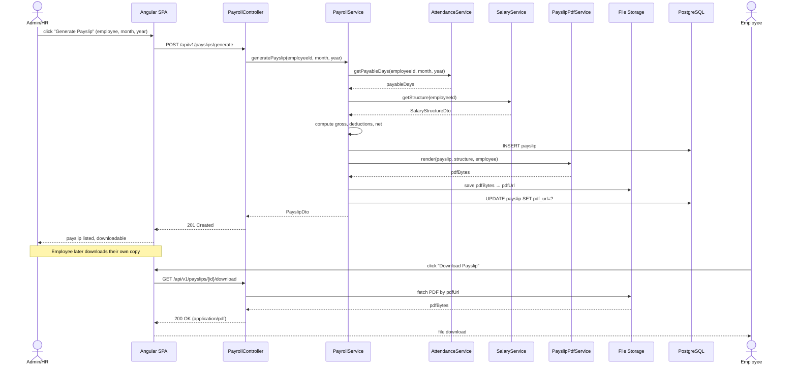
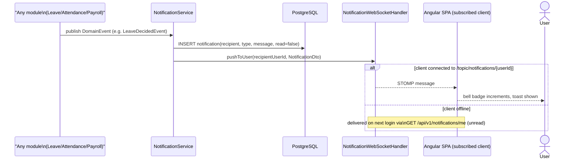

# Dayflow HRMS — Sequence Diagrams

> Runtime interaction detail for the key flows in [Process Flows](07-process-flows.md), showing component-level calls per the [LLD](03-lld.md) class model.

## 1. Sign In (JWT Issuance)

## 2. Admin Creates a New Employee (Provisioning)

## 3. Check-In / Check-Out

## 4. Apply for Leave

## 5. Approve / Reject Leave Request

## 6. Configure Salary Structure (Admin)

## 7. Payslip Generation & Download

## 8. In-App Notification Delivery (WebSocket)

---
**Related documents:** [Process Flows](07-process-flows.md) · [LLD](03-lld.md) · [API Documentation](09-api-documentation.md)
