# Class Diagram

This is a single, unified UML class diagram of the backend domain model, drawn
from the **final, implemented** entity classes in `hrmtool/src/main/java/com/dayflow/hrmtool/`
(as opposed to the per-module sketches in [`03-lld.md` §2](03-lld.md#2-class-diagrams-by-module),
which were authored during initial design and predate several field-level fixes
made during integration — see [`integration-evaluation-report.md`](../integration-evaluation-report.md)
if that file is still present locally).

All entities extend `BaseEntity` (`id: Long`, `createdAt: Instant`, `updatedAt: Instant`)
unless noted otherwise.

```mermaid
classDiagram
    class Company {
        +Long id
        +String name
        +String logoUrl
        +String initials
        +int workingDaysPerWeek
        +BigDecimal breakHours
    }

    class AppUser {
        +String loginId
        +String email
        +String passwordHash
        +Role role
        +boolean mustChangePassword
        +Long employeeId
    }
    class Role {
        <<enumeration>>
        ADMIN
        EMPLOYEE
    }

    class Employee {
        +Long companyId
        +String firstName
        +String lastName
        +String workEmail
        +String personalEmail
        +String phone
        +String jobPosition
        +String department
        +String location
        +Long managerId
        +String profilePictureUrl
        +LocalDate dateOfBirth
        +LocalDate dateOfJoining
        +int yearOfJoining
        +int serialNo
        +String residingAddress
        +String nationality
        +Gender gender
        +MaritalStatus maritalStatus
        +EmployeeStatus status
    }
    class Gender { <<enumeration>> }
    class MaritalStatus { <<enumeration>> }
    class EmployeeStatus {
        <<enumeration>>
        ACTIVE
        INACTIVE
    }

    class Resume {
        +Long employeeId
        +String about
        +String whatILoveAboutJob
        +String interestsAndHobbies
    }
    class Skill {
        +Long employeeId
        +String name
    }
    class Certification {
        +Long employeeId
        +String name
        +String issuer
        +LocalDate issueDate
    }
    class BankDetail {
        +Long employeeId
        +String accountNumber
        +String bankName
        +String ifscCode
        +String panNo
        +String uanNo
        +String empCode
    }

    class Attendance {
        +Long employeeId
        +LocalDate date
        +LocalTime checkInTime
        +LocalTime checkOutTime
        +Long workHours
        +Long extraHours
        +Long breakDuration
        +AttendanceStatus status
    }
    class AttendanceStatus {
        <<enumeration>>
        PRESENT
        ABSENT
        HALF_DAY
        ON_LEAVE
    }

    class LeaveType {
        +Long companyId
        +String name
        +boolean requiresAttachment
        +boolean isPaid
    }
    class LeaveRequest {
        +Long employeeId
        +Long leaveTypeId
        +LocalDate startDate
        +LocalDate endDate
        +BigDecimal numDays
        +String attachmentUrl
        +LeaveStatus status
        +Long approverId
        +String approverComment
        +Instant decidedAt
    }
    class LeaveStatus {
        <<enumeration>>
        PENDING
        APPROVED
        REJECTED
    }
    class LeaveAllocation {
        +Long employeeId
        +Long leaveTypeId
        +int year
        +BigDecimal allocatedDays
        +BigDecimal usedDays
    }
    class PublicHoliday {
        +LocalDate date
        +String name
    }

    class SalaryStructure {
        +Long employeeId
        +Double monthlyWage
        +Double yearlyWage
        +Double pfEmployeePercent
        +Double pfEmployerPercent
        +Double professionalTax
        +Integer workingDaysPerWeek
        +Double breakHours
        +LocalDateTime updatedAt
        +Long updatedBy
    }
    class SalaryComponent {
        +Long salaryStructureId
        +ComponentType type
        +ComputationType computationType
        +Double value
        +Double computedAmount
    }
    class ComponentType {
        <<enumeration>>
        BASIC
        HRA
        STANDARD_ALLOWANCE
        PERFORMANCE_BONUS
        LTA
        FIXED_ALLOWANCE
    }
    class ComputationType {
        <<enumeration>>
        FIXED
        PERCENTAGE
    }
    class Payslip {
        +Long employeeId
        +Integer month
        +Integer year
        +Double payableDays
        +Double grossSalary
        +Double pfEmployee
        +Double professionalTax
        +Double netSalary
        +Long generatedBy
        +LocalDateTime generatedAt
        +String pdfPath
    }

    class Notification {
        +Long userId
        +String title
        +String message
        +NotificationType type
        +boolean readStatus
        +String refType
        +Long refId
    }
    class NotificationType {
        <<enumeration>>
        INFO
        WARNING
        ALERT
        TASK
        LEAVE_REQUEST
        LEAVE_DECISION
        REMINDER
    }
    class NotificationPreference {
        +Long userId
        +NotificationType type
        +boolean emailEnabled
        +boolean pushEnabled
        +boolean smsEnabled
    }

    Company "1" --> "many" Employee : companyId
    Company "1" --> "many" LeaveType : companyId

    Employee "1" --> "0..1" AppUser : employeeId
    Employee "1" --> "1" Resume : employeeId (PK=FK)
    Employee "1" --> "1" BankDetail : employeeId (PK=FK)
    Employee "1" --> "many" Skill : employeeId
    Employee "1" --> "many" Certification : employeeId
    Employee "1" --> "many" Attendance : employeeId
    Employee "1" --> "many" LeaveRequest : employeeId
    Employee "1" --> "many" LeaveAllocation : employeeId
    Employee "1" --> "1" SalaryStructure : employeeId (PK=FK)
    Employee "1" --> "many" Payslip : employeeId
    Employee "0..1" --> "many" Employee : managerId (self-reference)

    LeaveType "1" --> "many" LeaveRequest : leaveTypeId
    LeaveType "1" --> "many" LeaveAllocation : leaveTypeId

    SalaryStructure "1" --> "many" SalaryComponent : salaryStructureId

    AppUser "1" --> "many" Notification : userId
    AppUser "1" --> "many" NotificationPreference : userId

    Employee ..> Gender
    Employee ..> MaritalStatus
    Employee ..> EmployeeStatus
    AppUser ..> Role
    Attendance ..> AttendanceStatus
    LeaveRequest ..> LeaveStatus
    SalaryComponent ..> ComponentType
    SalaryComponent ..> ComputationType
    Notification ..> NotificationType
    NotificationPreference ..> NotificationType
```

## Notes

- `AppUser.employeeId` is nullable in the schema, but in practice every seeded
  account (including the default Admin) now has a linked `Employee` — see
  `DataSeeder`. A `null` value is only expected for a hypothetical pure-system
  account with no HR profile.
- `Resume`, `BankDetail`, and `SalaryStructure` all use `employeeId` as their
  own primary key (a strict 1:1 extension of `Employee`, not a separate
  identity), rather than a generated `id` + foreign key.
- `Employee.managerId` is a self-referential foreign key back onto `Employee`,
  resolved at read time in `EmployeeService` to the manager's display name for
  the `EmployeeProfileDto.manager` field.
- `SalaryComponent.type = FIXED_ALLOWANCE` is always server-derived
  (`wage − Σ other components`) rather than client-supplied — see
  `SalaryService.recomputeComponents`.
